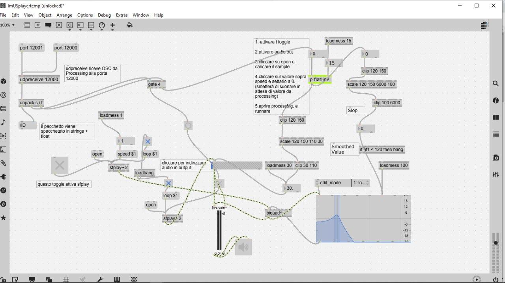

# ImUs
*ImUs* is an application that develops through the interaction with others. It investigates the sense of collectivity that technology can enhance and evolve. We believe collectivity to be something more than the sum of individuals.
*ImUs* is rooted in the key ideas of New Media Art:

- **Materiality:** the audience is engaged through the physical world
- **Embodiment:** mind and body have the same weight, they're not treated separately
- **The Cyborg:** the application have a certain degree of autonomy
- **Hybridity:** hybridity of disciplines involved is self evident; real world and virtual world merge through sound modulation and through visualization
- **Narrative:** the experience have starting point and a climax that can be reached by the audience
- **Interactivity:** the piece works through people

We developed the experience being inspired by those concepts, trying to convey our message.

See it here: (for presentation purpouses the visualization is on a computer screen)

# Tools
- *Exploration Space* - The portion of space dedicated to the users
- *First Camera* - Takes user photos
- *Second Camera* - Track users in the exploration space
- *Loudspeakers* - To listen to the exploration results
- *Projecting Screen* - To see the exploration results

# Scripts
comandantecheguevara.py links

# Step by Step

# Face Capture 
The users take pictures of their faces. The visualized ellipse defines the correct position and centering. The user can take a picture of himself when satisfied. Automatically, after the photo is acquired by webcam-capture-v1.01.py and stored in the selcted directory the code is ready for the next person. Once the photos have been taken the *exploration space* is ready to be used.

# People Tracking
As the audence enters the *exploration space* they are tracked by the camera. They are free to move and interact with others. They'll find themself immersed in a soundscape. 
The *second camera* films over the *exploration space*. people_counter.py utilizes a pre-trained neural network to recognize the onject "humans filmed by above" in the images taken by the camera. It assigns IDs to new people entering the view of the camera and tracks them between frames. Every ID is positioned on the computed centroid of the recognized object. 
The istallation is meant to be experienced by three people, but with appropriate customization this number can be changed.

# The Network
people_counter.py computes the area of the figure individuated by people IDs. Are values are sent via OSC messages through a LAN working on a hotspot or any other router. The python file works as a server for MaxMSP sound processing and for Processing video processing.

# Environmental Sound Modulation
What the user will hear is that their physical presence have an effect on the sound landscape they're immersed in. The sound is generated and processed by MaxMSP.

At the beginning, a first layer of two synth created with Hybrid 3 by AIR Music Technology is played in loop. It is filtered with a low pass which cutting frequency is controlled via OSC messages by the area between people.

# Face Merging
The faces obtained initially are merged by face_morpher, in particular by morpher.py via Delaunay triangulation. The method allows to compute an average for each possible couple of faces and a global average of all faces. The python code collects the images from the output directory of webcam-capture-v1.01.py.
videoer.py returns an .avi file with the transactions between the averages. 
The video is saved as themorph.avi in the selected directory.

# Visualization
What the user will see is that their physical presence have an effect on the visualization.
videoOSC.pde reads the video and decompose it in cells resembling single pixels. 
Those cells are exploded by the code in the 3 dimensions. 
The z coordinate is controlled via OSC messages by the area of the figure individuated by the IDs of people_counter.py. The bigger it is (the bigger the distance between people is), the bigger z will be. In this way, as the closeness between people increases the planar visualization increases, and so the clearness of the video visualization.
The video is put in loop and then played at random points every 22 frames for aestetics purpouses.
