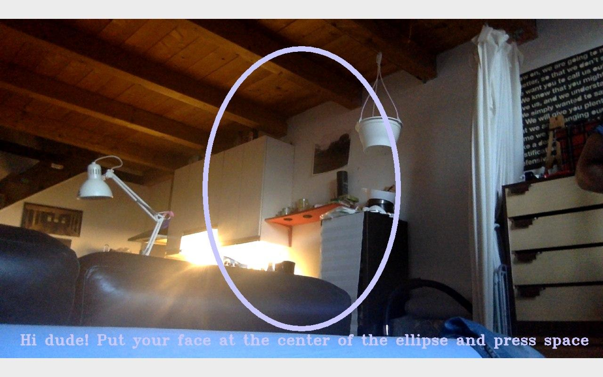
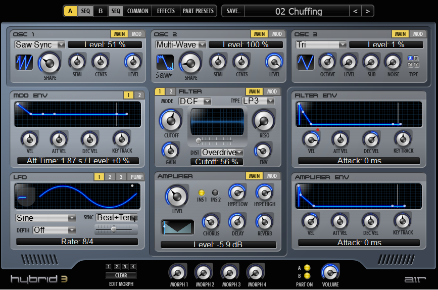

# ImUs
*ImUs* is an application that develops through the interaction with others. It investigates the sense of collectivity that technology can enhance and evolve. We believe collectivity to be something more than the sum of individuals.
*ImUs* is rooted in the key ideas of New Media Art:

- **Materiality:** the audience is engaged through the physical world
- **Embodiment:** mind and body have the same weight, they're not treated separately
- **The Cyborg:** the application has a certain degree of autonomy
- **Hybridity:** hybridity of disciplines involved is self evident; real world and virtual world merge through sound modulation and through visualization
- **Narrative:** the experience has a starting point and a climax that can be reached by the audience
- **Interactivity:** the piece works through people

We developed the experience being inspired by those concepts, trying to convey our message.

Realized in the course of Creative Programming and Computing, held by Prof. Massimiliano Zanoni

# Tools
- *Exploration Space* - The portion of space dedicated to the users
- *First Camera* - Takes user photos
- *Second Camera* - Track users in the exploration space
- *Loudspeakers* - To listen to the exploration results
- *Projecting Screen* - To see the exploration results

The computational cost of the scripts that are runned requires the use of more than a machine. We use three machines to balance the computational intesiveness of the application.

# Scripts

### About the first machine
- The application starts with the execution of *comandante.py* on the first machine. 
    - *comandante.py* calls *webcam-capture-v1.01.py*. The program loops for a number of times (customizable) equal to the number of users. 
        - At each iteration in the cycle the user is asked to take a picture of himself via the *first camera* on the first machine.
        - When the program has collected a picture for each user it ends and returns the control to *comandante.py*.  
    - *comandante.py* now calls *purpose.py* that customizes the library *morpher.py* to merge the images. 
        - *locator.py* locates face points, using the libraries cv2 and dlib, and returns the array of points to compute the triangulation
        - *aligner.py* script align faces by resizing, centering and cropping to given size 
        - *warper.py* warps an image over another, receiving as inputs two images and their face points 
            - The script triangulates the points and affine transforms each triangle with biliniear interpolation. 
        - *morpher.py* execute the morphing of the two or more images given as inputs, returning the list of transitions, as frames, to morph an image into the other 
        - *averager.py* returns the static average image between the inputs given
        - *blender.py* ends the process by blending the images in one 
        - *videoer.py* is the scripts that receive as inputs *morpher.py* frames and returns the .avi video file of the transitions in a customized directory. 
    - the control switches back to *comandante.py* 
        - call to *videoOSC.pde* which is working on top of the generated video to generate the final visualization for the audience 
    - When the .pde is terminated the flow returns for the last time to *comandante.py* to terminate the whole process.

### About the second machine, the master
On the second machine *people_counter.py* (computes the area of the figure individuated by people IDs.) is runned, using the *second camera* as frame acquisition device. 
*people_counter.py:*

- gets the frame from the *second camera*
    - every *n=30 (customizable)* frames:
        - convert the frame to a blob and pass the blob through the pretrained network and obtain the object detections. The selected class of object to detect is human. The network is trained with images of humans
        - loop over detections and filter out weak and useless detections. Those defintions are customizable
        - construct a dlib rectangle object and start the dlib correlation tracker
        - add the tracker to our list of trackers
    - else:
        - update the tracker and grab the updated position
        - use the *centroid_tracker.py* to associate the (1) old object centroids with (2) the newly computed object centroids
    - loop over the tracked objects:
        - check to see if a trackable object exists for the current object ID
        - create if there is no existing trackable object, otherwise utilize it to count
        - compute the area value of the figure individuated by the current object IDs using their current coordinates
        - send the area value to the sound processor (MaxMSP patch) and to the visualization (Processing script)
    - draw IDs on video

### About the third machine
The whole third machine is used for the correct and smooth running of the MaxMSP sound processing patch.

# Step by Step

## Face Capture 
The users take pictures of their faces. The visualized ellipse defines the correct position and centering. 

The user can take a picture of himself by pressing spacebar when satisfied. Automatically, after the photo is acquired by *webcam-capture-v1.01.py* and stored in the selected directory, the code is ready for the next person. Once the photos have been taken the *exploration space* is ready to be used.

## People Tracking
As the audence enters the *exploration space* they are tracked by the camera. They are free to move and interact with others. They'll find themself immersed in a soundscape. 
The *second camera* films over the *exploration space* to track the people inside the space. 

The structure of the object detector/tracker is the following: there is a real object detector, built using a MobileNet Single Shot Detector, which is a combination of: 
1) an SSD which discretizes the output space of bounding boxes into a set of default boxes over different aspect ratios and scales per feature map location. At prediction time, the network generates scores for the presence of each object category in each default box and produces adjustments to the box to better match the object shape. 
2) A mobileNet, which uses depthwise separable convolution: The general idea behind depthwise separable convolution is to split convolution into two stages, a 3×3 depthwise convolution followed by a 1×1 pointwise convolution. This allows us to actually reduce the number of parameters in our network. 

The object detector computes the bounding boxes of the objects; then, on top of it  works an object tracker. The object detector detects the objects every 30 frames (but it is possible to customise the parameter): in the remaining frames the object tracker is used: the centroid tracking relies on the Euclidean distance between existing object centroids (i.e., objects the centroid tracker has already seen before) and new object centroids between subsequent frames in a video; the bounding boxes positions are changed with the use of a correlation filter, which is able to recognise the movement of an existing object and update the positions of the box and its centroid in the 29 frames between the two subsequent executions of the object detector; then the object detector is again executed and update the position of the objects (independently from the last frame); an object which was near to another object in the subsequent frame will simply mantain the same ID, no matter if it was updated by the object detector (every 30 frames) or by the object tracker (in the remaining frames).

The istallation is meant to be experienced by three people, but with appropriate customization this number can be changed.

## The Network
Since some of the programs are computationally expensive for a single laptop CPU's, three laptops are used. One for retriving the pictures, compute the face merging and run the Processing visualization. Another one for executing the tracking of the users. The third one for executing the MaxMSP application. Distance values are sent via OSC messages through a LAN working on a hotspot or any other router. *people_counter.py* works as a server for MaxMSP sound processing and for Processing video processing clients. The python file sends messages on machine IPs to customizable machine listening ports.

## Environmental Sound Modulation
What the user will hear is that their physical presence have an effect on the sound landscape they're immersed in. The sound is generated and processed by MaxMSP.

 

At the beginning, a first layer of two synth created with Hybrid 3 by AIR Music Technology is played in loop. It is filtered with a low pass which cutting frequency is What the user will hear is that their physical presence have an effect on the sound landscape they're immersed in. 
The sound is generated and processed by MaxMSP. At the beginning, a first layer of two synth, produced with Hybrid 3 by AIR Music Technology, is played in loop. It is filtered with a low pass which cutting frequency is controlled via OSC messages. The OSC value is sent to Max from a python program that take care of detecting the events on the playground. 
A second sample, produced with Diva by u-he, is also controlled in the patch. This time is fade-controlled in order to complete the sounscape, in poliphony with the first sample.
Of course, it is possible to upload whatever sample that will be modulated in the same way.

 

## Face Merging
The faces obtained initially are merged by face_morpher, in particular by morpher.py via Delaunay triangulation. The method allows to compute an average for each possible couple of faces and a global average of all faces. The python code collects the images from the output directory of *webcam-capture-v1.01.py*.
*videoer.py* returns an .avi file with the transactions between the averages. 

The video is saved as themorph.avi in the selected directory.

## Visualization
What the user will see is that their physical presence have an effect on the visualization.
*videoOSC.pde* reads the video and decompose it in cells resembling single pixels. 
Those cells are exploded by the Processing code in the 3 dimensions. 

The z coordinate is controlled via OSC messages by the area of the figure individuated by the IDs of *people_counter.py*. The bigger it is (the bigger the distance between people is), the bigger z will be. In this way, as the closeness between people increases the planar visualization increases, and so the clearness of the video visualization.
The video is put in loop and then played at random points every 22 frames for aestetics purpouses.

## Thanksgiving to
pyimagesearch @ https://www.pyimagesearch.com/2018/08/13/opencv-people-counter/ 

alyssaq @ https://github.com/alyssaq/face_morpher
